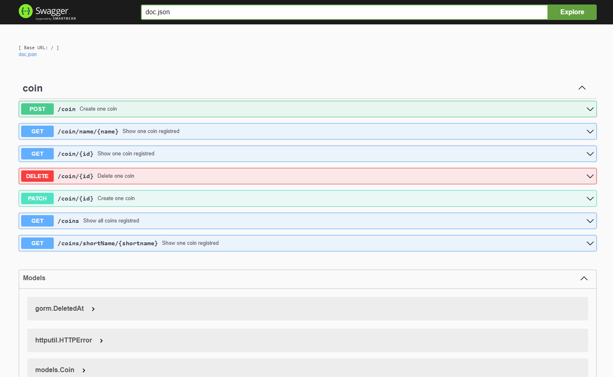

# API - UpVote - Golang
## This Golang code sends and saves the information about the value of the coins votes.

<div align="center">
  
</div>

<h3 align="center"> 
	  API - UPVote - Go 💲 Working...  👨‍💻
</h3>

<h4 align="center"> 
	https://api-upvote-golang.herokuapp.com/swagger/index.html
</h4>

<h3 align="center">
 <a href="#features">Features</a> •
 <a href="#-tecnologias">Tecnologias</a> • 
 <a href="#Pré-requisitos">Pré-requisitos</a> • 
 <a href="#-Documentação">Documentação</a> • 
 <a href="#autor">Autor</a>
</h3>

### Features
---

- [x] Criar servidor
- [x] Conectar com Docker
- [x] Construir controllers
- [x] Definir rotas
- [x] Implementar Testes
- [x] Gerar Documentação com os endpoints


### 🛠 Tecnologias
---


As seguintes ferramentas foram usadas na construção do projeto:

- [Go](https://go.dev/doc/)


### Pré-requisitos
---

Antes de começar, você vai precisar ter instalado em sua máquina as seguintes ferramentas:
[Git](https://git-scm.com), [Go](https://go.dev/doc/). 
Além disto é bom ter um editor para trabalhar com o código como [VSCode](https://code.visualstudio.com/)

### 🎲 Rodando o Back End (servidor)

```bash
# Clone este repositório
$ git clone <https://github.com/CaioLuColaco/API-UpVote-Golang.git>

# Acesse a pasta do projeto no terminal/cmd
$ cd API-UpVote-Golang

# Instale as dependências
$ go get ./...

# Execute a aplicação em modo de desenvolvimento
$ go run main.go

# O servidor inciará na porta:2005 - acesse <http://localhost:2005>

```

### 📒 Documentação
---
```bash
# Execute a aplicação em modo de desenvolvimento
$ go run main.go

# O servidor inciará na porta:2005 - 
Acesse no navegador: <http://localhost:2005/swagger/index.html>

```


### Autor
---

<a href="https://github.com/CaioLuColaco">
 
 <br />
 <sub><b>Caio Lucena Colaço</b></sub></a> <a href="https://www.instagram.com/caio_colaco/" title="Contato">👽</a>


Feito por Caio Lucena Colaço 👋🏽 Entre em contato!

[](https://www.linkedin.com/in/caiolucenacolaco/) 
[](mailto:caio.lcolaco@gmail.com)

